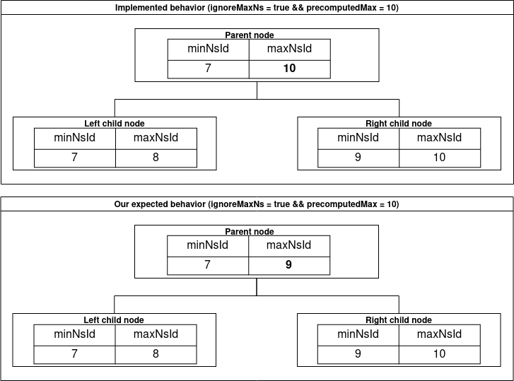

---
finding:
  id: IF-CELESTIA-03
  title: IgnoreMaxNS leads to false computing maxNs
  severity: ???
  impact: ???
  exploitability: ???
  type: Protocol
  status: ???
  issue: https://github.com/informalsystems/audit-celestia/issues/39
---

## Description

The logic for determining the `maxNs` with `n.ignoreMaxNS` set to true, is closely dependent on the fact that if the one namespace ID (`minNs` or `maxNs`) is equal to the `n.precomputedMaxNs` then both of them are. The documentation is not clear enough on this logic, and this behavior makes the Namespaced Merkle Tree library dependant on the data input.

If the nmt is used with the data that does not follow the previously mentioned fact, there is an issue with computing `maxNs` [here](https://github.com/celestiaorg/nmt/blob/4276d172f18c87ebdd18da0cc4b758f0dd164118/hasher.go#L256-L263). This issue can lead to setting `maxNs` to `n.precomputedMaxNs` even if it could be set to a namespace ID that is smaller than `n.precomputedMaxNs`.

If we assume the following:
- `n.ignoreMaxNS = true`
-  `leftMinNs != n.precomputedMaxNs`
-  `rightMaxNs = n.precomputedMaxNs`
-  `rightMinNs < n.precomputedMaxNs`
-  `rightMinNs>leftMaxNs`.

Than the `maxNs` will be set to `n.precomputedMaxNs` even if it should be set to `rightMinNs` because it is the largest namespaceId smaller than `n.precomputedMaxNs`.

Example with numbers (presented also in the image at the end):
Lets assume that following:
- precomputedMaxNs = 10
- ignoreMaxNS = true
- leftNode:  left{minNs: 7; maxNs:8 }
- rightNode:  right{minNs: 9; maxNs:10 }

Based on [this logic](https://github.com/celestiaorg/nmt/blob/4276d172f18c87ebdd18da0cc4b758f0dd164118/hasher.go#L256-L263) in `HashNode` the  `minNs` and `maxNs' for the node that is being calculated will take the following values:
- minNs = 7 (because it is the lowest value)
- maxNs = 10 or the `precomputedMaxNs` (because the `else` branch of the if statement will be executed and there 10 will obviously be chosen even if the  `right.minNs` is larger then `left.maxNs` but not equal to `precomputedMaxNs` ).

This numerical example with the current behavior and the behavior we expect is graphically  presented in the following image.

## Problem Scenarios
A hard understanding how calculation should be done and possibly this issue that could lead to falsy computed maxNs.

## Recommendation
We recommend to document well this behavior, and align the code with the documentation. It would seem that the nmt library should be independent.

## Status Update
In discussion. 